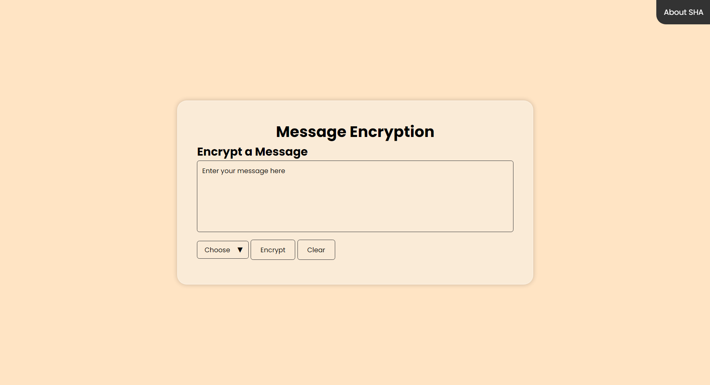

# Message-Hashing
This project is a simple web form that allows users to enter a message, select an encryption algorithm, and simulate the encryption of the message.

## Table of Contents
- [Project Overview](#project-overview)
- [Features](#features)
- [Usage](#usage)

## Project Overview
This project is a web-based application for encrypting messages using various encryption algorithms. The application provides a simple and intuitive user interface built with HTML and CSS, along with JavaScript to handle the encryption logic and interactivity. Users can input a message, select an encryption algorithm, and see the resulting encrypted message.

## Features
- <b>User-Friendly Interface:</b> A clean and responsive design using HTML and CSS.
- <b>Message Input:</b> A textarea for users to enter the message they want to encrypt.
- <b>Encryption Algorithm Selection:</b> A dropdown menu allowing users to choose from several encryption algorithms including SHA-256, SHA-1, SHA-384, and SHA-512.
- <b>Encryption Button:</b> A button to trigger the encryption process.
- <b>Clear Button:</b> A button to clear the input fields.
- <b>Alert Popups:</b> JavaScript-based alert popups to provide feedback on user actions.

## Usage
1. Open `index.html` in a web browser.
2. Enter a message in the textarea.
3. Select an encryption algorithm from the dropdown.
4. Click the "Encrypt" button to simulate encryption and see an alert with the entered information.
5. Click the "Clear" button to reset the form fields.

 
Contributions are welcome! If you have any suggestions or improvements, feel free to create a pull request or open an issue.
